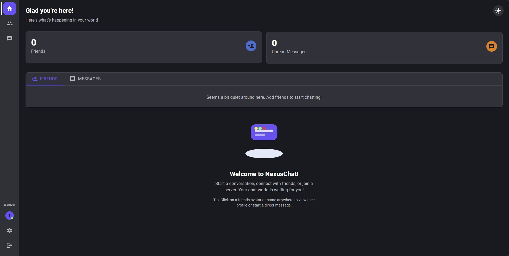
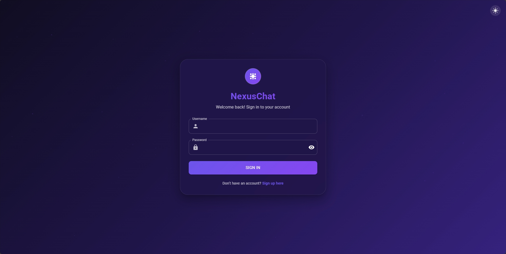
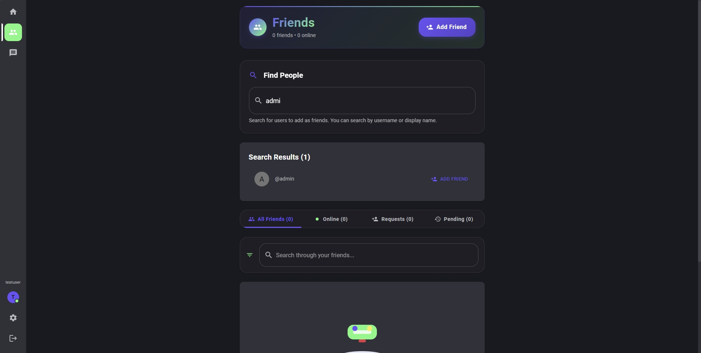
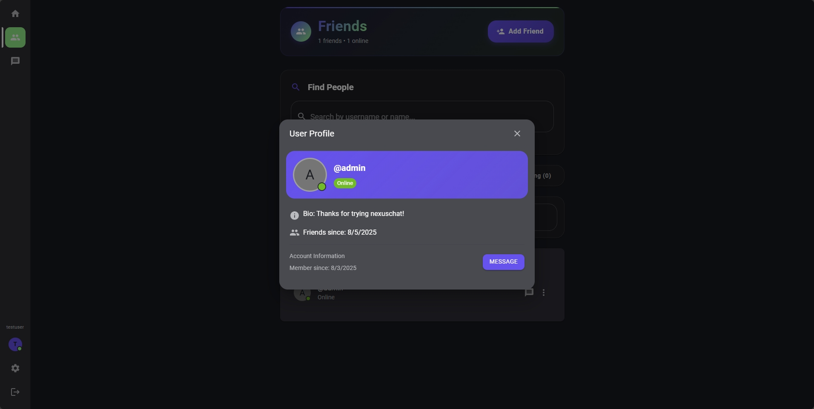
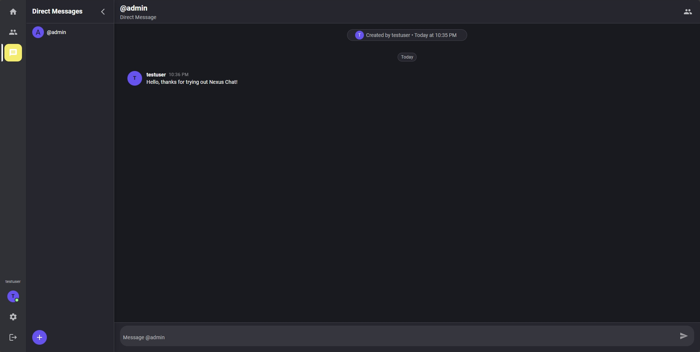
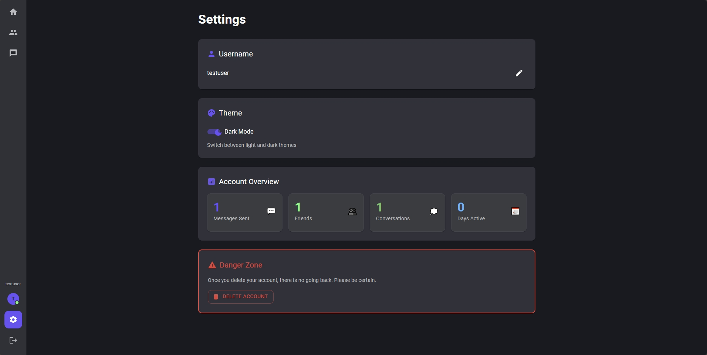
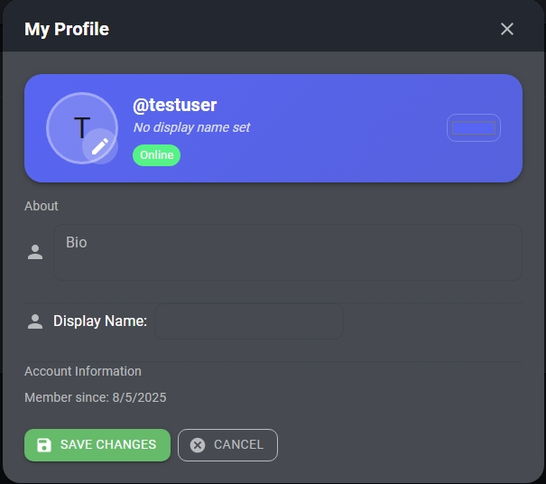

# NexusChat 🚀

A modern chat application built with React, Node.js, and PostgreSQL. Send direct messages to friends and stay connected.

## Features

NexusChat brings you a complete messaging experience with instant messaging, friend management, profile customization, and secure authentication - all wrapped in a beautiful, responsive real time interface.

## 🆓 Free Deployment

This project is designed to be **completely free** to deploy and use:
- **Frontend**: Vercel (free tier)
- **Backend**: Render (free tier) 
- **Database**: Supabase (free tier)

## 🛠️ Tech Stack

### Frontend
- **React 18** - Modern UI framework
- **Vite** - Fast build tool and dev server
- **Material-UI (MUI)** - Component library
- **Socket.IO Client** - Real-time communication
- **React Router** - Client-side routing

### Backend
- **Node.js** - JavaScript runtime
- **Express.js** - Web framework
- **Socket.IO** - Real-time bidirectional communication
- **PostgreSQL** - Reliable database
- **JWT** - Authentication tokens
- **Bcrypt** - Password hashing

## 📱 Screenshots

### 🏠 Homepage & Authentication

*Clean and modern homepage with user-friendly navigation*

*Secure login interface with elegant design*

*User registration with username validation*

*Password creation with security features*

### 👥 Social Features

*Comprehensive friends management system*

*Detailed user profiles with status information*

### 💬 Messaging Interface

*Real-time messaging with sidebar navigation*

### ⚙️ Settings & Customization

*Comprehensive settings and preferences*

*Profile customization with personalization options*

## 📄 License

This project is licensed under the MIT License - see the [LICENSE](LICENSE) file for details.

For setup and installation instructions, see [SETUP.md](SETUP.md).