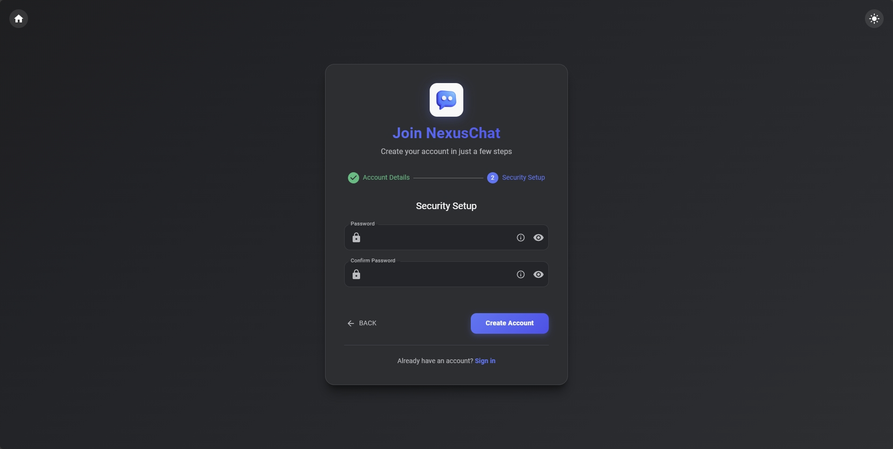

# NexusChat 🚀

A modern chat application built with React, Node.js, and PostgreSQL. Experience a stunning 3D landing page before diving into real-time messaging with friends.

## Features
NexusChat brings you a complete messaging experience with instant messaging, friend management, profile customization, and 
secure authentication - all wrapped in a beautiful, responsive real time interface.

## 🆓 Free Deployment

This project is designed to be **completely free** to deploy and use:
- **Frontend**: Vercel (free tier)
- **Backend**: Render (free tier) 
- **Database**: Supabase (free tier)

## 🛠️ Tech Stack

### Frontend
- **React 18** - Modern UI framework
- **Vite** - Fast build tool and dev server
- **Material-UI (MUI)** - Component library
- **Socket.IO Client** - Real-time communication
- **React Router** - Client-side routing

### Backend
- **Node.js** - JavaScript runtime
- **Express.js** - Web framework
- **Socket.IO** - Real-time bidirectional communication
- **PostgreSQL** - Reliable database
- **JWT** - Authentication tokens
- **Bcrypt** - Password hashing

## 📱 Screenshots

### 🚀 Landing Experience

*Immersive 3D laptop showcase with animated particles - your first impression of NexusChat*

### 🔐 Authentication

*Secure login*

*Simple username registration*

*Secure password creation*

### 🏠 Main Application

*Clean dashboard interface after login*

### 💬 Messaging & Social

*Real-time messaging with intuitive sidebar*

*Comprehensive friends system*

*Detailed user profiles and status*

### ⚙️ Personalization

*Complete settings and preferences*

*Personalize your profile and appearance*

## 📄 License

This project is licensed under the MIT License - see the [LICENSE](LICENSE) file for details.

For setup and installation instructions, see [SETUP.md](SETUP.md).